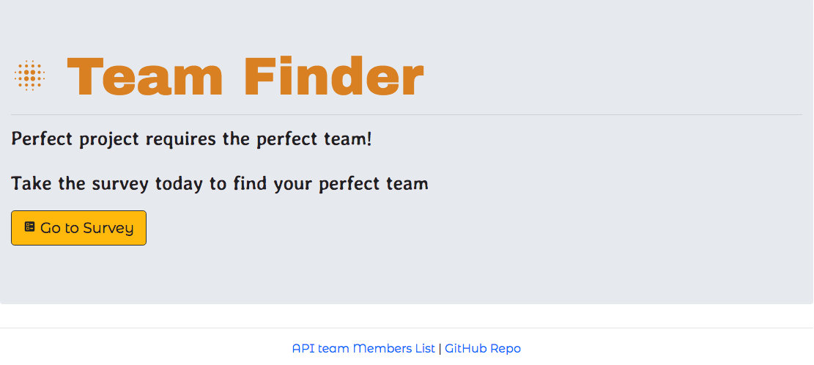
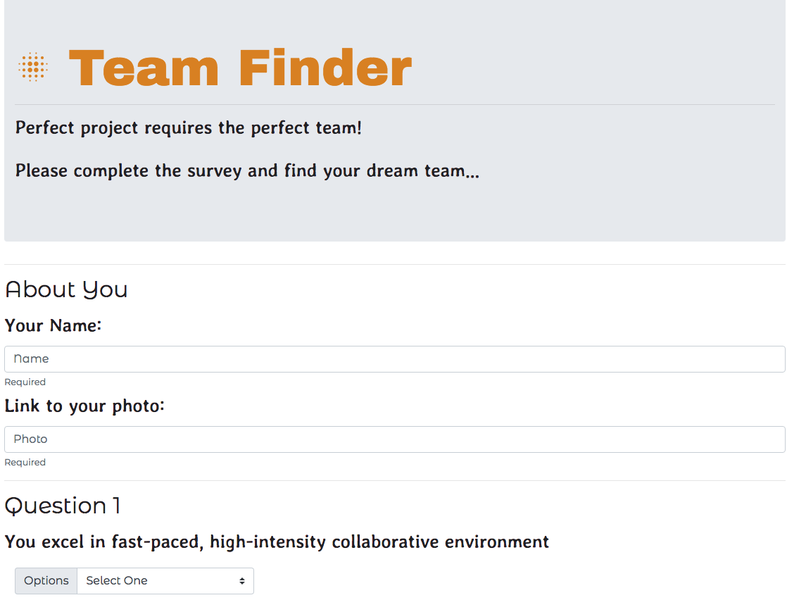

# teamFinder
## Description
This is a full-stack web app that allows users to fillout a 10 question survey and have a 4-member team displayed back to them wbased on the survey input and compatibility score calculated for members in the database.

Upon Comletion of the 10-question survey the user is shown a modal contining a 4 member team is displayed as bootstrap cards. 

The survey includes user input validation to make sure all the questions are answered and user name and photo links are provided.

---
## Tecnologies Used and Dependencies:
* **Front End:**
    * Bootsrap 4
    * Google Fonts
    * JQuery
    * Ajax
* **Back End:**
    * Node
    * Express
    * path 
    * bodyParser

---
### Homepage:

---
### Survey Page:

---
### Result Modal:
